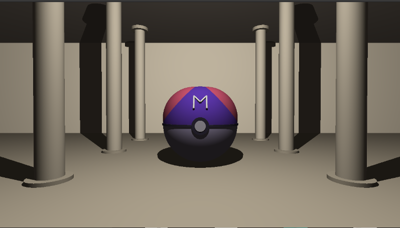
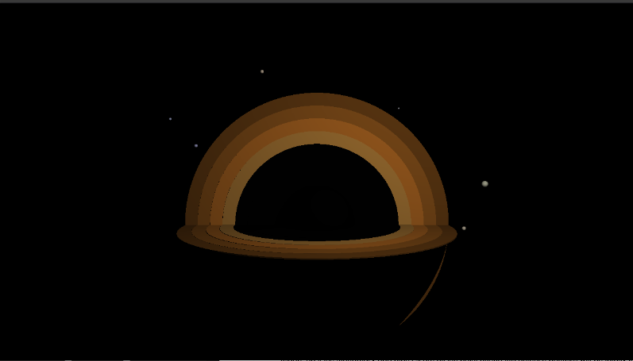
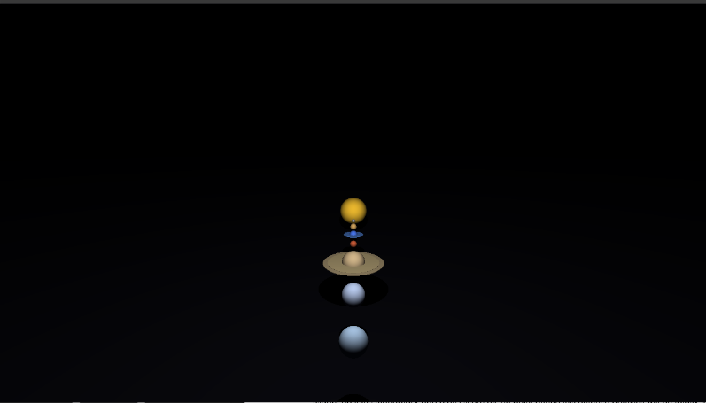

# 42 MiniRT
*This project has been created as part of the 42 curriculum by wcapt, ktiomico*

## Overview
### Description

MiniRT is a minimal ray tracer developed in C as part of the 42 curriculum.

The goal of this project is to build a simple rendering engine capable of generating 3D images using the ray tracing technique. The program renders a scene described in a `.rt` file, supporting basic geometric objects and lighting.

The objective is to understand how a 3D scene can be mathematically represented and rendered into a 2D image.

Our first raytracer handle the followings:
* Ambient, diffuse and specular lightning (phong effect)
* Light color and intensity
* Simple reflection (does not handle the light reflection)
* Simple refraction (does not handle light source refraction nor inside objects... yet)
* The followings primitive objects : Planes, Spheres, Cylinders

Possible upgrades coming in a near futur:
* Anti-aliasing (optional)
* Multi-threading (not allowed during the project, but added after)
* Texture map and bump map (only with diffuse lightning, handling on ambient lightning needs to be done)
* Limit angle on refraction
* Handling of objects inside transparent(refraction) ones
* More primitive objects such as Torus, squares, cubes, pyramides, maybe?
* Better light blending
* Soft shadows

### Goal

The goal of the program is to generate images using the Raytracing protocol. Those computer-generated images will each represent a scene, as seen from a specific angle and position, defined by simple geometric objects, and each with its own lighting system.

## Preview





### Prerequisites

MiniLibX for Linux requires xorg, x11 and zlib, therefore you will need to install the following dependencies: xorg, libxext-dev and zlib1g-dev. Installing these dependencies on Ubuntu can be done as follows:
```
sudo apt-get update && sudo apt-get install xorg libxext-dev zlib1g-dev libbsd-dev
```

### Raytracing

## How it works ?
Ray tracing is a rendering technique where rays are sent from the camera through each pixel into the scene to determine what object they hit. When a ray intersects an object (like a sphere, plane, or cylinder in MiniRT), the program calculates the exact intersection point and the surface normal at that point. This information is then used to compute the final color of the pixel.

### Installation and Instructions

1. Clone the project.
```
git clone git@github.com:Kai-Doh/minirt2.git NAME
```
2. Navigate to the project directory.
```
cd NAME
```
3. Compile the MiniRT. (You can ignore the Minilibx compilation warning)
```
make
```
4. Execution
```
./miniRT scenes/scene.rt
```

## Other available rules
```
make clean
make fclean
make re
```

## Scene Format (example)
`A 0.2 255,255,255`
`C -50,0,20 0,0,1 70`
`L -40,0,30 0.7 255,255,255`

`sp 0,0,20 20 255,0,0`
`pl 0,0,0 0,1,0 200,200,200`
`cy 50,0,20 0,0,1 14 21 0,0,255`

## References
- [gitbook.io](https://42-cursus.gitbook.io/guide/4-rank-04/minirt) - Official MiniRT project guide in the 42 curriculum
- [medium.com](https://medium.com/@iremoztimur/building-a-minirt-42-project-part-1-ae7a00aebdb9) - Detailed tutorial on building a ray tracer from scratch
- [scratchapixel.com](https://www.scratchapixel.com/) - Ray tracing fundamentals explained step by step
- [raytracing.github.io](https://raytracing.github.io/) - Free book “Ray Tracing in One Weekend”, perfect for getting started
- [github.com](https://github.com/) - Open-source MiniRT implementation with helpful comments
- [42born2code.slack.com](https://42born2code.slack.com/) - Discussions and tips about MiniRT within the 42 community (access required)
